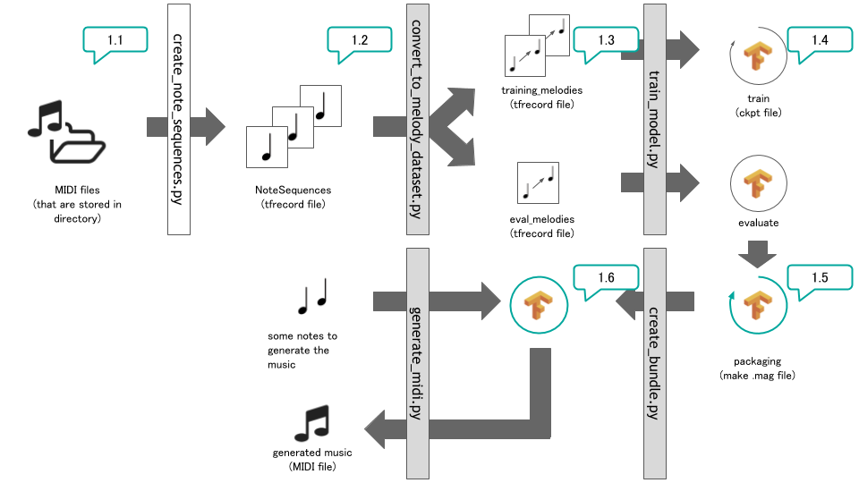
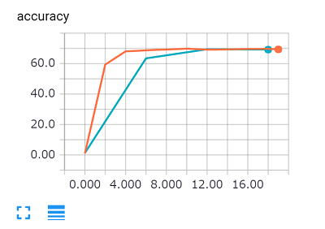

# Train your own model

You can create your own model by your MIDI files!
The procedure is almost same as [MelodyRNN](https://github.com/tensorflow/magenta/tree/master/magenta/models/melody_rnn). So please refer it as you need.



1. Prepare the MIDI data
2. Create the NoteSequence from MIDI files
3. Convert the NoteSequence to Dataset for Model
4. Training the Model
5. Create the Model
6. Generate the MIDI files

## 1. Prepare the MIDI data

Please gather your favorite MIDI files and store it to `data/raw`. You can find the MIDI files from following sites.

* [midiworld.com](http://www.midiworld.com/files/142/)
* [FreeMIDI.org](https://freemidi.org/)
* [The Lakh MIDI Dataset v0.1](http://colinraffel.com/projects/lmd/)

Game Music

* [Video Game Music Archive](http://www.vgmusic.com/)
* [THE MIDI SHRINE](http://www.midishrine.com/)

## 2. Create the NoteSequence from MIDI files

Run the following command to convert the MIDI files to `NoteSequence`.

```
python scripts/data/create_note_sequences.py
```

Then, you can find `notesequences.tfrecord` in the `data/interim` folder.

## 3. Convert the NoteSequence to Dataset for Model

We mainly use [`MelodyRNN`](https://github.com/tensorflow/magenta/tree/master/magenta/models/melody_rnn#melody-rnn), So convert the Notesequence by its dataset script.

You have to specify what kinds of model do you use by `--config` argument.

* basic_rnn
* lookback_rnn
* attention_rnn

```
python scripts/data/convert_to_melody_dataset.py  --config attention_rnn
```

At the same time, dataset is splited to training and evaluation. You can specify its rate by `--eval_ratio` (default is `0.1`).

## 4. Training the Model

If dataset is prepared, you can begin the training!  
Run the `train_model.py` and specify the model parameters like following.

```
python scripts/models/train_model.py --config attention_rnn --hparams="batch_size=64,rnn_layer_sizes=[64,64]" --num_training_steps=20000
```

([parameter is almost same as original](https://github.com/tensorflow/magenta/tree/master/magenta/models/melody_rnn#train-and-evaluate-the-model))

You can watch the training state by TensorBoard.  
Run the evaluation script...

```
python scripts/models/train_model.py --config attention_rnn --hparams="batch_size=64,rnn_layer_sizes=[64,64]" --num_training_steps=20000 --eval
```

Then invoke the TensorBoard and access [`http://localhost:6006`](http://localhost:6006).

```
tensorboard --logdir=models/logdir
```



## 5. Create the Model

After the training, then create your own model file.

```
python scripts/models/create_bundle.py --bundle_file my_model
```

Then, your model is stored in `models/` directory!

## 6. Generate the MIDI files

Now, let's try to generate the MIDI file! You can do it by below script.

```
python scripts/models/generate_midi.py --bundle_file=my_model --num_outputs=10 --num_steps=128 --primer_melody="[60]"
```

([parameter is almost same as original](https://github.com/tensorflow/magenta/tree/master/magenta/models/melody_rnn#generate-a-melody))

If it is succeeded, MIDI files will be stored at `data/generated` directory. Sounds Good? Enjoy!

[Now you can play with your own model](https://github.com/icoxfog417/magenta_session/tree/master/server).
